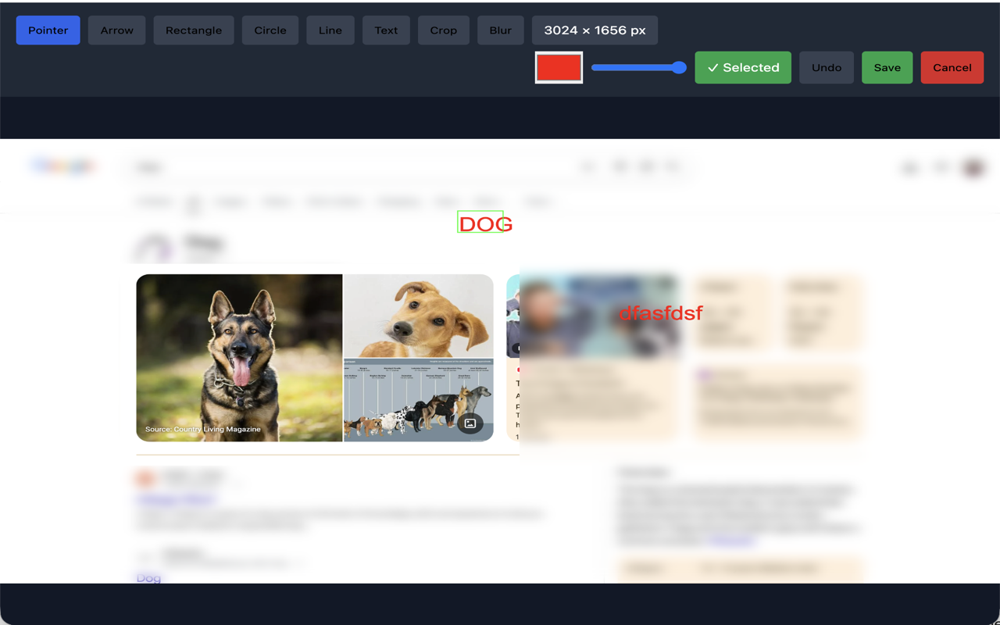
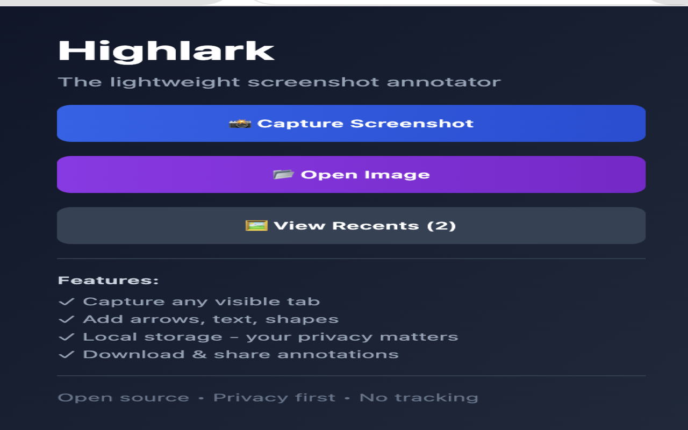
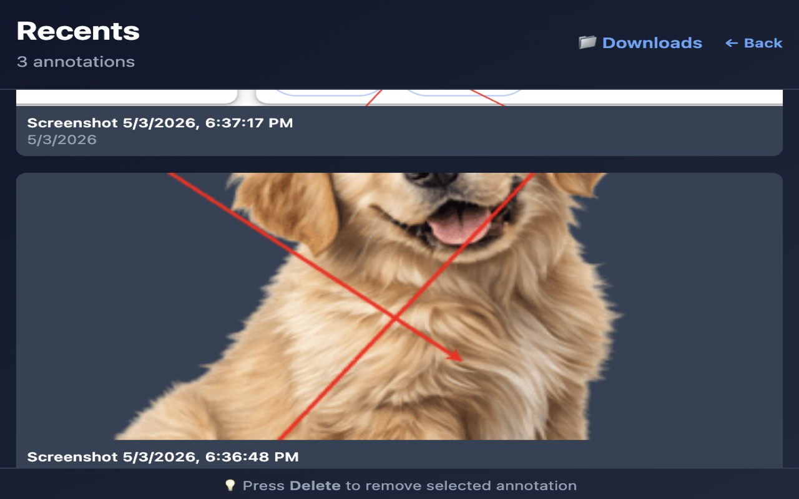
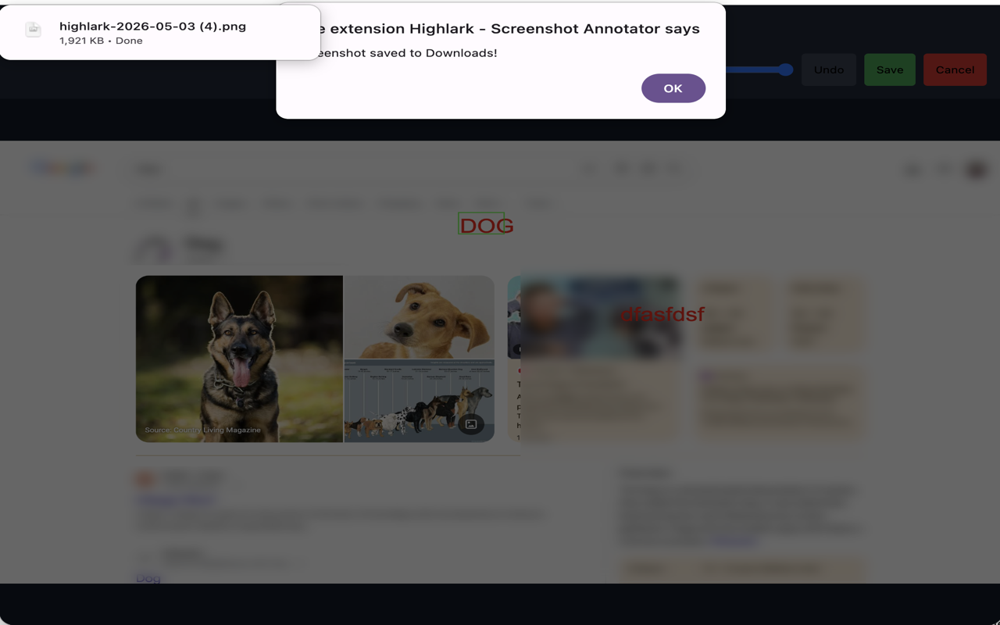

# Chrome Web Store Listing - Highlark

## Short Description (80 characters max)
The lightweight, privacy-first screenshot annotator. Capture, annotate & share.

## Detailed Description (1000+ characters)

### Highlark - Screenshot Annotation Made Simple

Capture any part of your screen, add professional annotations, and share instantly. Highlark is the annotation tool that respects your privacy.

**Why Choose Highlark?**
- **100% Private** — All your screenshots and annotations stay on your computer. Nothing is uploaded to servers. Ever.
- **Fast & Lightweight** — No bloat. Just the tools you need, nothing more.
- **Completely Free** — Open source, ad-free, forever.

**Powerful Features**
- 📸 **One-Click Screenshot** — Capture the active tab instantly
- 🖊️ **8 Annotation Tools** — Text, arrows, rectangles, circles, lines, image insert, crop, and blur
- 🎨 **Full Customization** — Choose colors, font sizes, and line widths
- ⌛ **Multi-Step Undo** — Undo dozens of actions, not just the last one
- 🔒 **Blur for Redaction** — Hide sensitive information with blur or invert-blur mode
- 💾 **Local Gallery** — All screenshots stored securely in your browser
- 📥 **Download & Share** — Export as PNG or generate shareable links
- ⚡ **Zero-Lag Performance** — Instant capture and smooth annotations

**Perfect For**
- 🐛 **Bug Reports** — Annotate issues with precise arrows and text
- 📚 **Education** — Highlight important content in tutorials and documentation
- 🎨 **Design Reviews** — Quick feedback with professional markups
- 📋 **Documentation** — Create clear step-by-step guides with images

**Privacy You Can Trust**
All your data stays on your device:
- ✓ No cloud storage
- ✓ No analytics or tracking
- ✓ No third-party integration
- ✓ Complete control over your content

**Open Source**
Review our code on GitHub and contribute: https://github.com/cbonoz/highlark

Start capturing and annotating like a pro. Download Highlark today.

---

## Category
Productivity

## Language
English

## Tags
screenshot, annotation, markup, capture, tools, privacy, open-source

## Screenshots
[See SCREENSHOTS_GUIDE.md for details]

All screenshots are 1280x800 pixels (Chrome Web Store standard)

### Screenshot 1: Annotate with Precision

Full annotation interface showing multiple tools in action - text, arrows, shapes, and more on a professional screenshot.

### Screenshot 2: Your Annotations, Organized

Quick access to recent screenshots from the convenient popup interface.

### Screenshot 3: Recents Gallery

View all your saved annotations in one organized gallery with easy access to your work.

### Screenshot 4: Seamless Saving

Export and download your annotated screenshots as PNG or generate shareable links.

## Promotional Tile (Optional)
The lightweight, privacy-first screenshot annotator.
