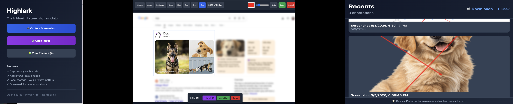

# Highlark

**The lightweight open-source screenshot annotator.**
Capture any screen, add text/arrows/images, and share professional markups instantly.



## Why Highlark?

- **Fast & Simple** — No bloat, just the tools you need
- **Privacy First** — Runs completely locally in your browser. All your annotations and storage are managed entirely on your computer—nothing is sent to external servers.
- **Open Source** — Free, open-source and community-driven

### Core Features & Use Cases

1. **Quick Feedback & Bug Reports**
   Capture a webpage or app screen, add arrows + text callouts, and copy a clean image or shareable link. Perfect for developers and designers sending precise feedback.

2. **Educational & Tutorial Content**
   Highlight important parts of tutorials, documentation, or lectures with shapes, text, and image stamps. Great for teachers, content creators, and students.

3. **Design Reviews & Collaboration**
   Annotate UI screenshots with arrows, blur sensitive areas, and add comments. Ideal for design teams iterating quickly without heavy tools.

## Implemented Features

### Screenshot Capture
- ✓ Capture the currently visible tab with one click
- ✓ Full tab screenshot support
- ✓ Instant preview before annotation

### Annotation Tools
- ✓ **Text** - Add customizable text with adjustable font size and color
- ✓ **Arrows** - Draw arrows with automatic arrowheads
- ✓ **Rectangles** - Outline important areas
- ✓ **Circles** - Highlight circular regions
- ✓ **Lines** - Draw straight lines
- ✓ **Crop** - Crop screenshots and adjust annotations automatically
- ✓ **Blur** - Redact sensitive information with standard or inverted blur (blur everything except selected area)
- ✓ **Color Picker** - Choose any color for annotations
- ✓ **Size/Font Control** - Adjust annotation size, line width, and font size
- ✓ **Multi-Step Undo** - Undo multiple actions including drawings, text, crops, blur, color changes, and placements

### Storage & Management
- ✓ **Local Gallery** - All annotations stored securely in your browser using IndexedDB
- ✓ **Annotation History** - Timestamps and auto-generated titles for each screenshot
- ✓ **Quick Preview** - View gallery thumbnails directly from the popup

### Export & Sharing
- ✓ **Download as PNG** - Save annotated screenshots as high-quality PNG files
- ✓ **Share Links** - Generate shareable links for easy distribution
- ✓ **Copy to Clipboard** - Share links automatically copy to your clipboard

### Privacy & Security
- ✓ All data stored locally - nothing uploaded to servers
- ✓ No analytics or tracking
- ✓ Complete control over your data
- ✓ Can be cleared anytime through browser settings

## Installation

### From Chrome Web Store (Recommended)

[Install Highlark from the Chrome Web Store](https://chromewebstore.google.com/detail/highlark-screenshot-annot/ahhigbflppojomkaoljjiikahdjoabgi)

### Local Development Installation

1. Clone or navigate to the project folder
2. Install dependencies:
   ```bash
   bun install
   ```

3. Build the extension:
   ```bash
   bun run build
   ```

4. Load into Chrome:
   - Open `chrome://extensions/`
   - Enable **Developer mode** (top right)
   - Click **Load unpacked**
   - Select the `build/` folder

### Development with Hot Reload

```bash
bun run dev
```

This watches the `src/` and `public/` directories for changes and automatically rebuilds.

### Build for Distribution

```bash
bun run build
```

### Pack for Release

```bash
bun run pack
```

## Project Structure

```
src/
  ├── background.ts              # Service worker for extension lifecycle
  ├── popup/
  │   ├── App.tsx               # Main popup component with UI
  │   └── index.tsx             # Popup entry point
  ├── options/
  │   └── index.tsx             # Options/settings page
  ├── components/
  │   └── AnnotationCanvas.tsx  # Canvas drawing interface
  ├── storage.ts                # IndexedDB management
  ├── screenshot.ts             # Screenshot capture utilities
  └── utils.ts                  # General utilities

public/
  ├── manifest.json             # Extension manifest
  ├── popup.html                # Popup HTML
  ├── options.html              # Options HTML
  └── icons/                    # Extension icons

config/
  ├── build.ts                  # Build configuration
  ├── watch.ts                  # Watch mode configuration
  └── ...
```

## Tech Stack

- **React 18** - UI framework
- **TypeScript** - Type safety
- **Tailwind CSS** - Styling
- **IndexedDB** - Local storage
- **Canvas API** - Drawing annotations
- **Chrome Extensions API** - Browser integration
- **Bun** - Build tooling and package management

## Usage Guide

### Taking a Screenshot
1. Click the Highlark icon in your toolbar
2. Click "Capture Screenshot"
3. Wait for the screenshot to be captured
4. The annotation canvas will open automatically

### Annotating
1. Select a drawing tool (Arrow, Rectangle, Circle, Line, or Text)
2. Choose your color using the color picker
3. For text, adjust the font size with the slider
4. Click and drag on the canvas to draw
5. For text: click where you want to add text, type your text, press Enter

### Managing Annotations
1. Click "View Gallery" from the home page
2. View all your saved annotations
3. Click on any annotation to view it full-size
4. Use Download, Share, or Delete buttons as needed

### Sharing
1. Open an annotation in the gallery
2. Click "Share" to generate a shareable link
3. The link is automatically copied to your clipboard
4. Share the link with others (they can view the image)

## Privacy & Security

Highlark prioritizes your privacy:

- **Zero Knowledge** - We never see your screenshots
- **Offline First** - Works completely without internet
- **Local Storage** - Everything stored in your browser's IndexedDB
- **No Tracking** - No analytics, no telemetry, no ads
- **Open Source** - Code is transparent and auditable

## Permissions

Highlark requests minimal permissions and avoids unnecessary access:

- **activeTab** - To capture screenshots of your current tab
- **storage** - To store annotations locally in your browser (IndexedDB)
- **windows** - To open the annotation editor after capturing
- **downloads** - To let you download annotated screenshots

**No broad host permissions** - We don't need access to all websites. Everything stays on your device.

## Future Enhancements

Potential features for future releases:

- [ ] Image stamp/sticker support
- [ ] OCR for text extraction
- [ ] Cloud sync (optional, opt-in)
- [ ] Keyboard shortcuts customization
- [ ] Drawing history/timeline
- [ ] Collaborative annotations
- [ ] Mobile support
- [ ] Dark/light theme toggle
- [ ] Batch screenshot editing

## Example Use Cases

**For Developers:**
- Report bugs with annotated screenshots
- Document UI changes
- Create visual guides for code reviews

**For Designers:**
- Annotate design mockups
- Mark up feedback on UI designs
- Create specs with visual callouts

**For Content Creators:**
- Highlight tutorial steps
- Create educational graphics
- Add captions to screenshots

**For Teams:**
- Share feedback quickly
- Create visual documentation
- Collaborate on designs without heavy tools

## Contributing

Highlark is open source and welcomes contributions! Please feel free to:

- Report bugs
- Suggest features
- Submit pull requests
- Improve documentation

## License

Highlark is open source under the MIT License.

## Inspiration

We were inspired by tools like [MarkupHero](https://markuphero.com/) and wanted to create a lightweight, privacy-focused alternative that runs entirely in your browser.

## Support

- **Issues & Bugs**: Open an issue on GitHub
- **Feature Requests**: Discuss in the issues section
- **General Questions**: Check the options page (click extension icon and view settings)

## Disclaimer

Highlark is provided as-is without warranties or guarantees. Use at your own discretion. The extension is community-maintained and may have limitations. Always verify important work independently.

---

Made with care for makers, designers, and developers everywhere.
